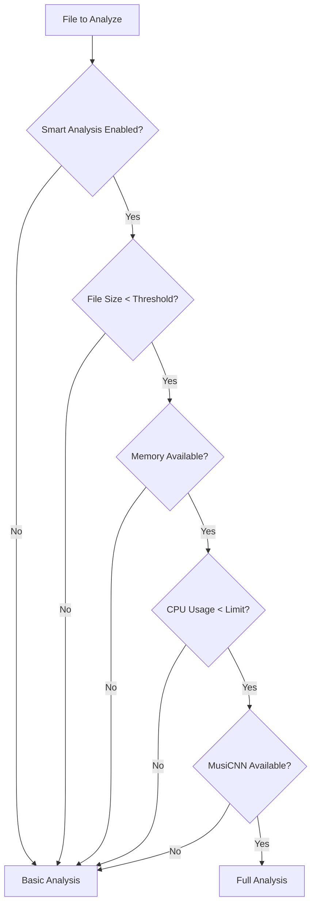

# Smart Analysis System Guide

This guide explains how the playlist generator determines which files receive **full MusiCNN analysis** vs **basic analysis** based on file size and system resources.

## 🎯 Overview

The **Smart Analysis System** automatically decides whether to use:
- **Full Analysis**: MusiCNN deep learning features (200 dimensions) + basic features
- **Basic Analysis**: Standard audio features only (BPM, spectral, loudness, etc.)

## 🔍 Decision Factors

### 1. **File Size Thresholds**
```python
# Parallel Processing (Conservative)
PARALLEL_MAX_FILE_SIZE_MB = 50    # Files > 50MB get basic analysis

# Sequential Processing (More Permissive)  
SEQUENTIAL_MAX_FILE_SIZE_MB = 200  # Files > 200MB get basic analysis
```

### 2. **Memory Requirements**
```python
# Parallel Processing
PARALLEL_MIN_MEMORY_GB = 2.0      # Need 2GB+ available RAM

# Sequential Processing
SEQUENTIAL_MIN_MEMORY_GB = 3.0     # Need 3GB+ available RAM
```

### 3. **CPU Usage Limits**
```python
# Parallel Processing
PARALLEL_MAX_CPU_PERCENT = 70      # CPU < 70% usage

# Sequential Processing
SEQUENTIAL_MAX_CPU_PERCENT = 85    # CPU < 85% usage
```

### 4. **MusiCNN Availability**
- TensorFlow must be available
- MusiCNN model files must be loaded
- Model files must be accessible

## 📊 Analysis Types

### **Full Analysis (MusiCNN + Basic)**
```python
{
    'bpm': 120.5,
    'loudness': -12.5,
    'spectral_centroid': 2500.5,
    'key': 'C',
    'mfcc': [0.1, 0.2, 0.3, ...],  # 13 coefficients
    'musicnn_features': [0.1, 0.2, 0.3, ...],  # 200 dimensions
    'metadata': {...}
}
```

### **Basic Analysis (Standard Features Only)**
```python
{
    'bpm': 120.5,
    'loudness': -12.5,
    'spectral_centroid': 2500.5,
    'key': 'C',
    'mfcc': [0.1, 0.2, 0.3, ...],  # 13 coefficients
    'metadata': {...}
}
```

## ⚙️ Configuration

### **File Size Settings**
```ini
# Maximum file size for full analysis
MAX_FULL_ANALYSIS_SIZE_MB=100
MIN_FULL_ANALYSIS_SIZE_MB=1

# Parallel vs Sequential thresholds
PARALLEL_MAX_FILE_SIZE_MB=50
SEQUENTIAL_MAX_FILE_SIZE_MB=200
```

### **Resource Settings**
```ini
# Memory requirements
MIN_MEMORY_FOR_FULL_ANALYSIS_GB=4.0
MEMORY_BUFFER_GB=1.0

# CPU limits
MAX_CPU_FOR_FULL_ANALYSIS_PERCENT=80
CPU_CHECK_INTERVAL_SECONDS=1

# Parallel processing (conservative)
PARALLEL_MIN_MEMORY_GB=2.0
PARALLEL_MAX_CPU_PERCENT=70

# Sequential processing (permissive)
SEQUENTIAL_MIN_MEMORY_GB=3.0
SEQUENTIAL_MAX_CPU_PERCENT=85
```

### **Behavior Settings**
```ini
# Enable/disable smart analysis
SMART_ANALYSIS_ENABLED=true

# Fallback behavior
ANALYSIS_TYPE_FALLBACK=true

# Resource monitoring
RESOURCE_MONITORING_ENABLED=true
```

## 🔄 Decision Flow



## 📈 Performance Impact

### **Processing Speed**
- **Basic Analysis**: ~2-5 seconds per file
- **Full Analysis**: ~5-15 seconds per file (3x slower)

### **Memory Usage**
- **Basic Analysis**: ~50-100MB per file
- **Full Analysis**: ~200-400MB per file (4x more memory)

### **CPU Usage**
- **Basic Analysis**: ~20-40% CPU
- **Full Analysis**: ~60-80% CPU (2x more CPU)

## 🎯 Use Cases

### **Full Analysis Recommended For:**
- ✅ Small files (< 50MB)
- ✅ High-quality music files
- ✅ Research/analysis purposes
- ✅ When MusiCNN models are available
- ✅ When system has sufficient resources

### **Basic Analysis Recommended For:**
- ✅ Large files (> 100MB)
- ✅ Quick processing needs
- ✅ Limited system resources
- ✅ When MusiCNN is unavailable
- ✅ Batch processing of many files

## 🔧 Troubleshooting

### **All Files Using Basic Analysis**
```bash
# Check if MusiCNN is available
docker exec playlista python -c "import tensorflow; print('TensorFlow OK')"

# Check if model files exist
docker exec playlista ls -la /app/feature_extraction/models/

# Check system resources
docker exec playlista python -c "import psutil; print(f'Memory: {psutil.virtual_memory().available/1024**3:.1f}GB')"
```

### **Performance Issues**
```ini
# Reduce thresholds for better performance
PARALLEL_MAX_FILE_SIZE_MB=25
PARALLEL_MIN_MEMORY_GB=4.0
PARALLEL_MAX_CPU_PERCENT=50

# Or disable smart analysis entirely
SMART_ANALYSIS_ENABLED=false
```

### **Memory Issues**
```ini
# Increase memory requirements
MIN_MEMORY_FOR_FULL_ANALYSIS_GB=6.0
MEMORY_BUFFER_GB=2.0

# Or use more conservative settings
PARALLEL_MAX_FILE_SIZE_MB=25
SEQUENTIAL_MAX_FILE_SIZE_MB=100
```

## 📊 Monitoring

### **Analysis Statistics**
The system logs analysis decisions:
```
🎵 Extracting full features from: song.mp3
✅ File eligible for full analysis: 25.3MB, 4.2GB RAM, 45.2% CPU

🎵 Extracting basic features from: large_song.mp3
File too large for full analysis: 150.2MB > 50MB
```

### **Resource Monitoring**
```python
# Real-time resource checking
import psutil
memory = psutil.virtual_memory()
cpu_percent = psutil.cpu_percent()

print(f"Available Memory: {memory.available/1024**3:.1f}GB")
print(f"CPU Usage: {cpu_percent:.1f}%")
```

## 🎯 Best Practices

### **For Optimal Performance:**
1. **Use appropriate file sizes**: Keep files under 50MB for full analysis
2. **Monitor system resources**: Ensure sufficient RAM and CPU
3. **Batch similar files**: Process similar-sized files together
4. **Use sequential for large files**: Sequential processing handles large files better

### **For Maximum Quality:**
1. **Enable full analysis**: When resources permit
2. **Use MusiCNN models**: For advanced similarity matching
3. **Monitor quality metrics**: Check analysis success rates
4. **Tune thresholds**: Adjust based on your specific needs

## 🔄 Fallback Behavior

If full analysis fails, the system automatically falls back to basic analysis:
```python
try:
    # Attempt full analysis
    result = extract_features(file_path, use_full_analysis=True)
except Exception as e:
    # Fallback to basic analysis
    result = extract_features(file_path, use_full_analysis=False)
```

This ensures **100% processing success** while maximizing quality where possible. 